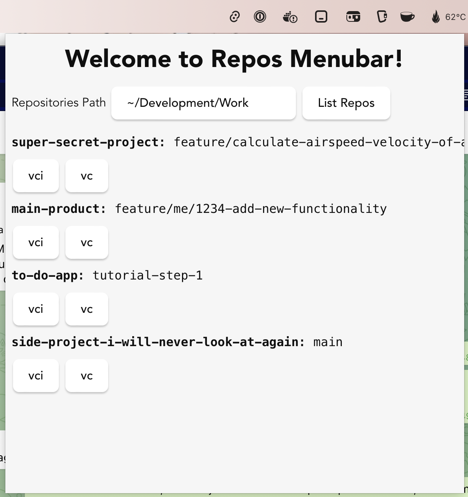

# Repos Menubar App

A simple Tauri app built with Svelte and TypeScript.

## Getting started

Requires [pnpm](https://pnpm.js.org/), [Rust](https://www.rust-lang.org/), and [Tauri CLI](https://tauri.studio/en/docs/getting-started/intro).

```bash
pnpm tauri dev
```

### Recommended IDE Setup

[VS Code](https://code.visualstudio.com/) + [Svelte](https://marketplace.visualstudio.com/items?itemName=svelte.svelte-vscode) + [Tauri](https://marketplace.visualstudio.com/items?itemName=tauri-apps.tauri-vscode) + [rust-analyzer](https://marketplace.visualstudio.com/items?itemName=rust-lang.rust-analyzer).

## Using the app

- Run the dev command or build a new binary for your platform with `pnpm tauri build`.
- Click the menubar
- Set the folder you want to list repos from


